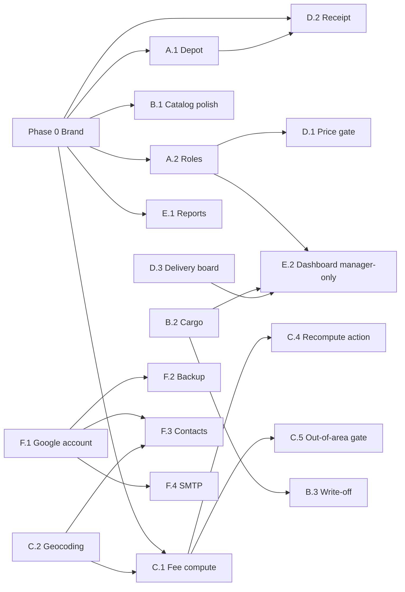

# Implementation Plan — Remaining MVP Scope

> **Companion to**: [`docs/prd/prd-fa-distribuidora.md`](prd/prd-fa-distribuidora.md) (v1.5.0)
> **Snapshot date**: 2026-05-18
> **Target go-live (M7)**: 2026-08-20
> **MVP completion at snapshot**: ~40%
> **Language policy**: all artifacts in English; UI strings in pt-BR (per PRD §5 *Stack*).

This plan sequences every MVP item the PRD still lists as ⛔ Not started or 🟡 Partial. It is opinionated about ordering — pre-requisites first, biggest revenue impact next, integrations last. Effort is expressed as **S / M / L / XL** rough work-day buckets: S ≤ 1 day, M = 2–3 days, L = 4–7 days, XL > 7 days.

---

## Guiding principles

1. **Artisan-first**. Every Laravel artifact (model, migration, resource, page, widget, command, seeder, factory, policy) is generated with `php artisan make:*` and then edited. No hand-written files.
2. **TDD**. Each phase below ships with Pest 4 tests written before the implementation. New behaviours go into either `tests/Feature/Models/*` (Eloquent + business logic), `tests/Feature/Filament/*` (resource / page / widget interactions via `livewireTest`), or `tests/Feature/Database/*` (migrations + seeders).
3. **Pest run in parallel** whenever the work is parallel-safe. Avoid parallel runs for tests that touch the same singletons.
4. **One concern per phase**. A phase ends with a commit, a green Pest run, and a documentation entry — never a half-finished surface.
5. **Snapshot, never recompute on sales** (PRD §F10). All fee, price and totals logic that touches sales must read the snapshot columns; only customer-side flows compute.
6. **Brand compliance is non-negotiable** (PRD [NFR-01](./prd/prd-fa-distribuidora.md#nfr-01--brand-compliance)). Every phase exit-criterion includes a "Brand compliance" line: no hardcoded hex / font outside the files listed in [`docs/DESIGN.md`](./DESIGN.md) §9, every customer-facing surface consumes the `<x-fa.*>` components. Phase 0 below sets up the substrate that makes this possible — it ships **before** any other feature work.

---

## Sequencing rationale (read this before the table)

The PRD's milestone order (M1 → M7) is correct in spirit but a few items deserve to be **pulled forward** because they unlock multiple downstream phases:

- **F10 (auto-compute customer fees) blocks F02 recompute action**. If we ship the recompute action before the compute service exists, the action has nothing to call. So F10's service must land first, then F02's bulk action wraps it.
- **F11 (Delivery dispatch board) needs a `Delivery` model**. The current `Sale` carries delivery metadata inline, which is enough for the create flow but not for the board's "pending / completed" lifecycle. Lifting the lifecycle into its own table is the smallest correct fix.
- **F12/F13 (reports + dashboard) need real data**. Both surface aggregates over confirmed sales — they should ship together near the end of M5, after the operational features are solid.
- **F01 (Depot config) is tiny and blocks the receipt header**. It can be done in a single small phase whenever convenient; suggested early so the rest of the work assumes it exists.

The phases below follow this revised order, mapped back to PRD milestones.

---

## Phases

### Phase 0 — Brand Retrofit (cross-cutting)

Ships **before** Phase A. Locks the substrate that makes NFR-01 enforceable on every subsequent feature.

| Step | Deliverable | Effort | Notes |
|------|-------------|--------|-------|
| 0.1 | **R1 — Token CSS variables**: declare `--fa-azul-profundo`, `--fa-azul-cristal`, `--fa-amarelo-solar`, `--fa-branco-mineral`, `--fa-tinta-noite` in `resources/css/filament/admin/theme.css`. Refactor existing selectors (heading font-family, login gradient) to consume them. Mirror the same values in `AdminPanelProvider::colors` with an explicit "synced with theme.css" comment | S | Pure refactor — visual output is bit-identical for now |
| 0.2 | **R2 — Apply Branco Mineral + Tinta Noite**: panel page background uses `var(--fa-branco-mineral)`; default body text uses `var(--fa-tinta-noite)`. Verify dark-mode contrast (dark-mode is not in MVP scope but the tokens must not break it) | S | First visible change |
| 0.3 | **R3 — `<x-fa.wave-divider />` Blade component**: single SVG source under `resources/views/components/fa/wave-divider.blade.php`. Accepts `color`, `inverted`, `class` props. Used as the canonical section divider | S | |
| 0.4 | **`config/brand.php`** literals (name, tagline, address, hours, phones) + audit any existing template that hard-codes those strings — replace with `config('brand.*')`. The Filament panel name `FA Distribuidora` and the `APP_NAME` env value both read from this | S | |
| 0.5 | **Brand-compliance test**: `tests/Feature/DesignSystemTest.php`. Greps the `app/`, `resources/`, `config/` trees for `#[0-9A-Fa-f]{3,8}` and `font-family:` outside the allowed source files, fails the build when a violation is introduced | S | Automated NFR-01 verification |

**Exit criterion**: `pest --group=design` is green, all five Acceptance Criteria of NFR-01 flip to `[x]`, no visible regression on the existing screens. The `<x-fa.disk-entregas />` component is **not** in Phase 0 — it lands inside Phase D (with the receipt) since that's the first surface that needs it.

---

### Phase A — Foundation completion (M1 wrap-up)

| Step | Feature | Effort | Notes |
|------|---------|--------|-------|
| A.1 | **F01 — Depot Configuration**: `php artisan make:model Store -m`. Single-row table holding name, address, lat, lng, contact. Filament page lives next to `Settings`. Receipt header reads from it (deferred until receipt itself exists, but the data is in place) | S | Acceptance criteria: 3 of 3 |
| A.2 | **Role-based access**: `php artisan make:migration add_role_to_users_table` (column `role` with enum `manager / attendant / deliverer`). Three Filament navigation policies: `ManagerOnly`, `AttendantOrManager`, `DelivererCanRead`. Seed two users (one manager, one attendant) for local + staging | M | Touches every existing resource — add `canAccess` and resource-level policies |
| A.3 | **Password reset wiring**: confirm Laravel's bundled email reset works end-to-end with Gmail SMTP (deferred to Phase F integration, but the routes + UI are scaffolded now) | S | |
| A.4 | **Pest coverage**: factories for `Store` and the new `role` value; policy tests asserting that an attendant cannot view `StockMovementResource::create` or `Settings` | S | |

**Exit criterion**: `php artisan test` green; manager / attendant / deliverer can each sign in and only see what they should. **Brand compliance**: any new login / role-related screen uses tokens from Phase 0; the depot configuration page consumes `config('brand.*')` for read-only "Default values" display.

---

### Phase B — Catalog & stock completion (M2 wrap-up)

| Step | Feature | Effort | Notes |
|------|---------|--------|-------|
| B.1 | **F03 polish**: visual warning in `ProductForm` when `sale_price < cost_price`. Use a `Forms\Components\Placeholder` reacting to live state. Pest test through `livewireTest` asserting the warning appears | S | |
| B.2 | **F05 — Cargo / Stock-In** | L | See cluster below |
| B.3 | **F06 expiry write-off** | M | See cluster below |

**Cluster B.2 — Cargo / Stock-In**
- `php artisan make:model Cargo -m`, `php artisan make:model CargoItem -m`
- Migration columns: `cargos(supplier nullable, received_at, user_id, notes)`; `cargo_items(cargo_id, variant_id, quantity, purchase_price, expires_at nullable)`
- On `Cargo::saved`, generate one `stock_movements` row per `CargoItem` with `direction=in`, `reason='cargo'`, `source_type=CargoItem::class`, `source_id=cargo_item.id`. Existing `Variant::current_stock` continues to work without changes.
- `ProductVariant::weighted_average_cost` computed attribute (sum of `cargo_item.quantity * purchase_price` ÷ sum quantity).
- Filament: `CargoResource` with a `CargoItem` repeater (variant select, qty, purchase price, expiry).
- Pest: cargo create → stock movements + average cost updated; cargo edit/delete is **forbidden** after first save (to preserve audit trail); expiry on perishables required (validation rule).

**Cluster B.3 — Expiry write-off**
- New `StockMovement::REASON_WRITE_OFF` + UI to mark a cargo-batch as expired (creates an OUT movement against the cargo item).
- `Settings` page gains `near_expiry_threshold_days` (default 30) — read by a new product-batch near-expiry widget (mirrors `ExpiringShells`).
- Pest: write-off decrements `current_stock`; near-expiry widget shows correct counts at threshold boundaries.

**Exit criterion**: cargo can be entered through the UI; `current_stock` matches IN-OUT-WRITEOFF math; near-expiry widget visible to manager. **Brand compliance**: the new near-expiry widget uses the same token + wave-divider conventions as `ExpiringShells`.

---

### Phase C — Customers & fees completion (M3)

| Step | Feature | Effort | Notes |
|------|---------|--------|-------|
| C.1 | **F10 — Customer fee compute service**: `app/Services/CustomerFeeCalculator.php`. Pure class with `compute(Customer $c, DeliverySetting $s): array{delivery_fee, building_fee, in_delivery_area}`. Wired into `Customer::saving` (skips when `has_manual_fee_override`) | M |
| C.2 | **Geocoding via Nominatim**: `php artisan make:service AddressGeocoder` (with rate-limit-respecting throttle), fills `customer_addresses.lat/lng` on save. On `CustomerAddress::saved` for a primary address with new coords, retrigger `CustomerFeeCalculator` for the parent customer | M | Public Nominatim has a 1 req/s polite limit — queue + retry |
| C.3 | **F07 polish**: phone search on `CustomersTable` (`->searchable(query: …)` joining phones); customer infolist showing `distance_km`, `delivery_fee`, `building_fee`, `has_manual_fee_override`, `fees_calculated_at` | S | |
| C.4 | **F02 — Recompute customer fees**: `Settings` page header action `recomputeFees`. Iterates customers where `has_manual_fee_override = false`, calls `CustomerFeeCalculator`, persists. Records run in a new `delivery_setting_revisions` table for the change history | M | Acceptance criteria: 4 of 4 covered after this lands |
| C.5 | **F09 out-of-area gating**: `out_of_area_override` visible/editable in `SaleForm` only when `customer.in_delivery_area === false`. Edits create an `audit_log` entry (introduce a minimal `audit_logs(model_type, model_id, field, before, after, user_id, reason, created_at)` table — same shape will serve F09's price override and discount-reason audit) | M |
| C.6 | **F08 polish**: per-period date filter + per-product filter on `SalesRelationManager`; "Total spent in period" summary row; "Top recurring product" computed view | M |

**Exit criterion**: creating a customer with an address auto-fills fees; manager can hit "Recompute all" and see counts of updated / skipped customers; sales for out-of-area customers expose the override only for them and log the edit. **Brand compliance**: customer infolist uses Display font for the customer name + key totals; "Recompute fees" confirmation modal styled with Solar Yellow warning treatment.

---

### Phase D — Sales hardening + Delivery dispatch (M4 wrap-up)

| Step | Feature | Effort | Notes |
|------|---------|--------|-------|
| D.1 | **F09 manager-only price gating**: `unit_price` editable only when `Auth::user()->role === 'manager'` (or via a per-attendant action "Request override" that logs to `audit_logs`) | S |
| D.2 | **F09 printable receipt**: `routes/web.php::sales/{id}/receipt` returning a Blade view styled for an A5 or thermal 80mm width. Header from F01 depot. Optionally a `php artisan make:component ReceiptHeader` to share between A5 and 80mm versions | M | The thermal printer hardware itself is P1 — only the print-ready view ships in MVP |
| D.3 | **F11 — Daily Delivery Dispatch Board** | L | See cluster below |

**Cluster D.3 — Delivery dispatch board**
- `php artisan make:model Delivery -m` (one-to-one with `sales`; columns: `sale_id`, `deliverer_id`, `status` ∈ {pending, en_route, completed, cancelled}, `scheduled_at`, `completed_at`, `cancellation_reason`, `returned_shells_json` optional). Created automatically when a `Sale` of type `delivery` is confirmed.
- `php artisan make:filament-page DeliveryBoard` (a custom page, not a resource). Two Livewire-backed lists: **Pending** + **Completed today**. Polls every 30 s for the deliverer view (configurable). Filters: district (from `customer_addresses`), deliverer, status.
- Actions: *Start route* (`pending → en_route`), *Mark delivered* (`en_route → completed` + records returned shells when applicable, which deducts the matching `WaterShellLedger` rows), *Cancel with reason* (`* → cancelled` + reverses the parent sale's stock via existing `Sale::reverseStock`).
- Pest: state transitions; cancellation reverses stock; returned-shell records update the ledger correctly.

**Exit criterion**: deliverer signs in on their phone, sees only deliveries assigned to them, and can complete one in two taps. Manager sees everyone's lists. **Brand compliance**: printable receipt uses `<x-fa.wave-divider />` between header / items / totals, the brand logo as a watermark, `<x-fa.disk-entregas />` as the footer, and the Display font for the total. Delivery board mobile view: 44 px touch targets (per §6 *Accessibility*), buttons in Azul Profundo, completion confirmation in Solar Yellow.

---

### Phase E — Reports & dashboard (M5)

| Step | Feature | Effort | Notes |
|------|---------|--------|-------|
| E.1 | **F12 — Separated listings — Water vs General** | M |
| E.2 | **F13 — Consolidated admin dashboard** | L |

**Cluster E.1 — F12 Separated listings**
- Two new pages: `WaterSalesPage` and `GeneralSalesPage`. Both back the same `SaleResource` model with scoped queries (`->where('contains_water', true)` vs `->where('contains_water', false)`).
- Each lists: today's view + complete-history view (toggle).
- Mixed sales (sales containing both water and non-water items) appear in both with a `mixed` badge — already detectable from `contains_water` plus `items()->whereHas('variant.product.category', fn ($q) => $q->where('slug', '!=', 'agua'))`.
- Export: `Tables\Actions\ExportAction` with CSV (Filament v5 native) and an XLSX target if a lightweight writer is acceptable.
- Reprint receipt from any row using D.2's view.

**Cluster E.2 — F13 Dashboard**
- New dashboard page (replace Filament default).
- Widgets (each `php artisan make:filament-widget …`):
  - KPIs: total revenue (period), average ticket, water-share-of-revenue %, accumulated card fees
  - Sales/day chart (line)
  - Water vs. rest chart (stacked bar)
  - Top products + top customers tables
  - Payment-method breakdown (4 cards: cash / pix / debit / credit)
- Filters at the page level: date range, customer, product, attendant, type, category, payment method — propagated to every widget via shared state.
- Manager-only via the same policy from Phase A.
- Export PDF (DomPDF on a route) and XLSX.

**Exit criterion**: manager opens `/admin/dashboard`, picks "last 30 days", and sees every KPI populated. **Brand compliance**: every chart uses palette tokens (line = Azul Profundo, bar fill = Azul Cristal + Amarelo Solar pair); KPI cards use Display font for the big number; "Disk Entregas" card with brand phone CTA pattern is included on the dashboard footer.

---

### Phase F — Google integrations (M6)

| Step | Feature | Effort | Notes |
|------|---------|--------|-------|
| F.1 | **Dedicated FA Google account provisioning** | S | Manual; depends on stakeholder action |
| F.2 | **F15 — Automated backup to Google Drive** | L | See cluster |
| F.3 | **F16 — Two-way Google Contacts sync** | XL | See cluster |
| F.4 | **Gmail SMTP wiring + password reset acceptance test** | S | |

**Cluster F.2 — F15 Backup**
- `composer require google/apiclient google/apiclient-services` (verify ARM64 wheels).
- `php artisan make:command BackupDatabase` (uses `mysqldump` inside the Docker app container).
- Scheduled via `app/Console/Kernel.php` daily at 03:00 BRT.
- Upload via Drive API to a dedicated folder; rotate keeping the last 30.
- Filament Settings page: status of the last run (✓/✗ + date + size) + "Run backup now" button.
- Failure: email manager via Gmail SMTP.

**Cluster F.3 — F16 Contacts sync**
- `php artisan make:service GoogleContactsSync` — handles initial import (with confirmation count), recurring sync via `syncToken`, and conflict resolution by last-write-wins.
- Wired to scheduled task running every 15 min; Filament page surfaces pause/resume.
- On a new Google address with no lat/lng → enqueue geocode via Phase C's `AddressGeocoder`, then recompute fees.
- Group / label: default "FA Distribuidora", configurable from Settings.

**Exit criterion**: manager grants OAuth once; daily backup lands in Drive; contacts edits on either side appear on the other within 15 min. **Brand compliance**: the OAuth / status pages in Settings render with the same tokens as the rest of the panel; any operational email (backup failure, sync conflict) uses a Blade template that consumes `config('brand.*')` and the wave divider.

---

### Phase G — Hardening + go-live (M7)

| Step | Feature | Effort | Notes |
|------|---------|--------|-------|
| G.1 | E2E test suite via Playwright (3–5 happy-path scripts: counter sale, delivery sale with shell exchange, recompute fees, dispatch a delivery, run backup) | M |
| G.2 | Performance pass: index review (composite indexes on `(customer_id, created_at)`, `(status, created_at)`, etc. — already partly done in `sales` migration); EXPLAIN on the dashboard queries | M |
| G.3 | Training for the manager + 1–2 attendants. Parallel usage with the paper notebook for 10 days | L |
| G.4 | Production go-live: switch staging label to production, archive of the seeded test data, fresh DB | S |

---

## Dependency graph



The two longest paths are **A.2 → C.5 → D.1 → D.2 → E.2** (sales hardening + dashboard) and **F.1 → F.3** (contacts sync). Phase F can run in parallel with Phase E once the Google account is provisioned.

---

## Risk callouts

| Risk | Likelihood | Impact | Mitigation |
|------|------------|--------|------------|
| Nominatim rate-limit blocks bulk recompute on first ramp | M | M | Cluster requests + 1 req/s throttle; cache by ZIP+street; manual override on row |
| Filament v5 Repeater + Livewire polling stress on the dispatch board | M | M | Cap poll to 30 s; ditch poll in favor of broadcasted events later if needed (Reverb is in the dependency tree) |
| Google Drive API quota exhaustion at 1000 backups | L | L | Rotation already keeps 30; quota is 1 billion requests / project / day |
| ARM64 Docker images missing for `google/apiclient` C extensions | M | M | Most pure-PHP; verify before merge. Pin versions in `composer.json` |
| Out-of-area-gating regression bypassing the audit log via raw Eloquent updates | L | M | Add a `Sale::saving` guard: if `out_of_area_override` changed and customer is in-area, throw |

---

## Test-first checklist per phase

Each phase MUST land with these Pest groups green:

- **Models**: `tests/Feature/Models/<Entity>Test.php` — invariants, scopes, computed attributes
- **Filament**: `tests/Feature/Filament/<Resource>Test.php` — list / create / edit / authorization
- **Database**: `tests/Feature/Database/*` — migrations + seeders
- **Policies**: `tests/Feature/Policies/*` (added in Phase A) — role-based access

Run locally with the project's helper image (PHP 8.4 + intl):

```bash
docker run --rm -v "$PWD:/app" -w /app fa-test:php84 ./vendor/bin/pest --parallel
```

---

## Estimated total effort to MVP

| Phase | Total effort | Notional calendar weeks (single developer at ~0.6 FTE) |
|-------|--------------|---------------------------------------------------------|
| 0 | ~1 day | 0.2 |
| A | ~1 week | 1 |
| B | ~1.5 weeks | 1.5 |
| C | ~2 weeks | 2 |
| D | ~1.5 weeks | 1.5 |
| E | ~1.5 weeks | 1.5 |
| F | ~2 weeks | 2 |
| G | ~1 week | 1 |
| **MVP total** | **~10.7 weeks** | **10–11 weeks** |

The PRD's go-live target is 2026-08-20 (~13 weeks from the snapshot date). The plan fits the target with ~2 weeks of buffer **only if** Phase F (Google integrations) starts in parallel with Phase E. Sequential execution slips go-live by 2–3 weeks. Phase 0 absorbs into the existing buffer.

---

## Change Log

| Version | Date | Author | Changes |
|---------|------|--------|---------|
| 1.0.0 | 2026-05-18 | Anderson de Oliveira Venturini | Initial plan — companion to PRD v1.5.0. Sequences A → G with cluster-level breakdown, dependency graph, risk callouts and effort estimate |
| 1.1.0 | 2026-05-18 | Anderson de Oliveira Venturini | Added **Phase 0 — Brand Retrofit** (CSS variables, `config/brand.php`, `<x-fa.wave-divider />`, automated `tests/Feature/DesignSystemTest.php` compliance gate) and a "Brand compliance" exit-criterion line on every other phase. References PRD [NFR-01](./prd/prd-fa-distribuidora.md#nfr-01--brand-compliance) and [`docs/DESIGN.md`](./DESIGN.md). Dependency graph + effort table updated |
