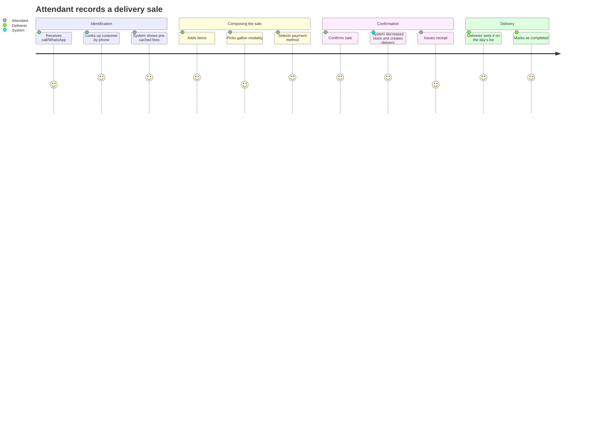
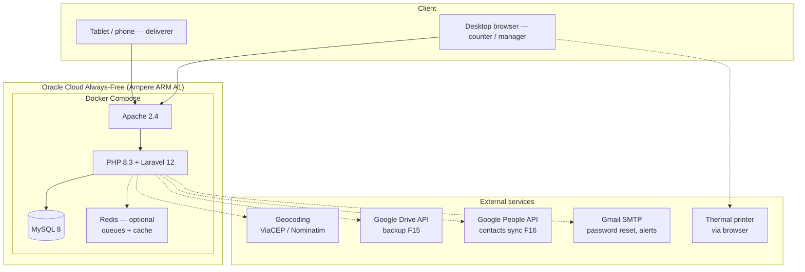
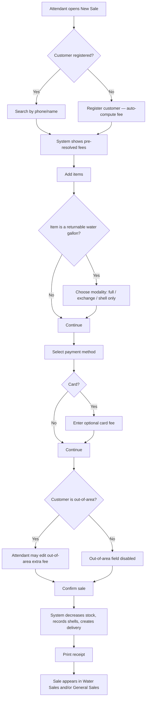
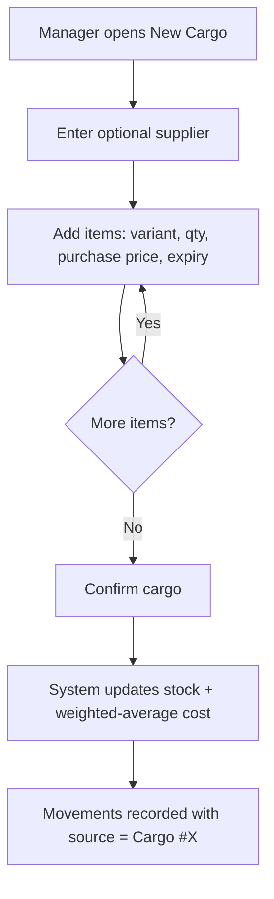
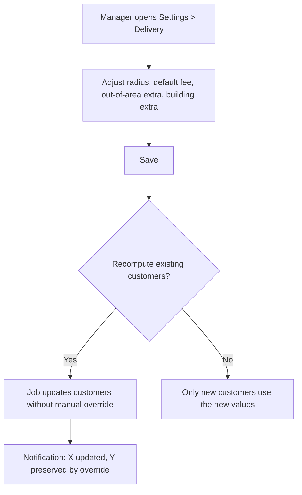
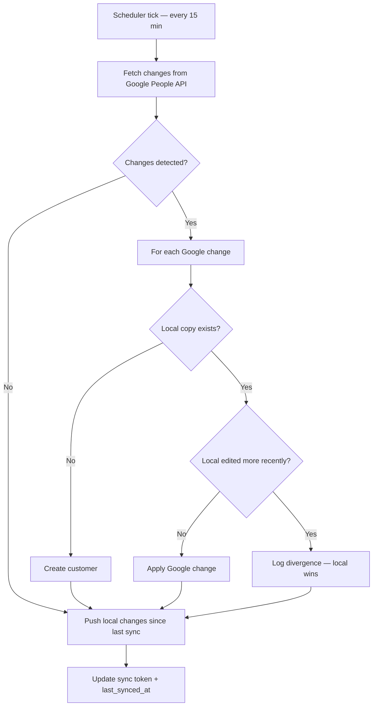
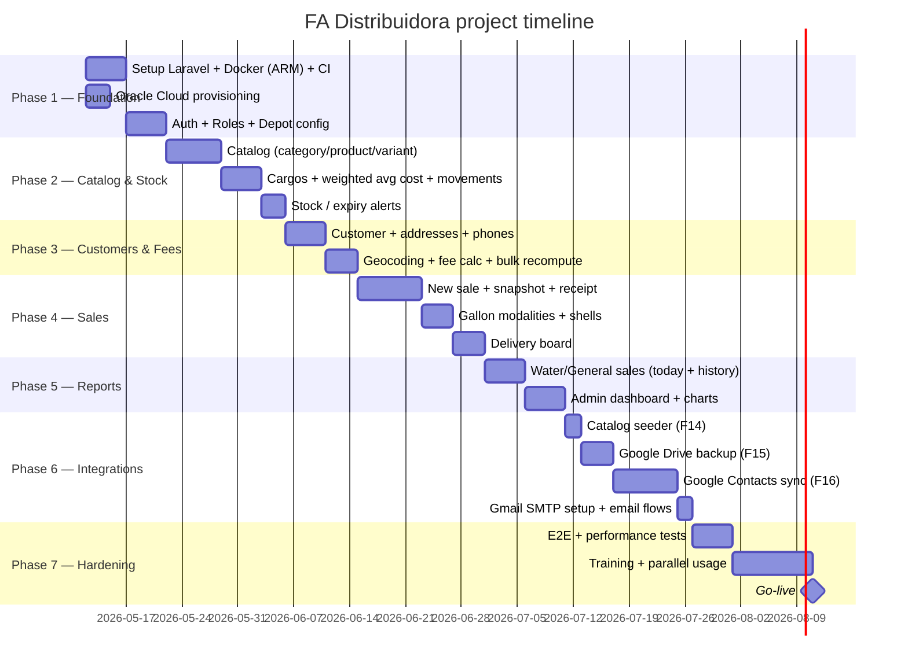

# PRD — FA Distribuidora Management System

> **Version**: 1.5.0
> **Status**: Draft — Implementation in progress
> **Created**: 2026-05-09
> **Last Updated**: 2026-05-18
> **Author**: Anderson de Oliveira Venturini
> **Customer**: FA Distribuidora — Water · Beverages · Charcoal (Av. Transamazônica, 1197 — Jardim Garcia, Campinas-SP, Brazil)
> **Staging / testing URL**: <https://fa.andersonventurini.cloud>
> **Implementation plan**: see [`docs/IMPLEMENTATION_PLAN.md`](../IMPLEMENTATION_PLAN.md)

---

## Confirmed Baseline Configuration

Values and decisions consolidated after the requirements clarification round with the owner (2026-05-09):

| Item | Value / Decision |
|------|------------------|
| Delivery radius | **2 km** (covers Jardim Garcia and immediately adjacent streets) |
| Default delivery fee (inside area) | **R$ 2.00** (configurable) |
| Out-of-area extra fee | **+R$ 1.00** on top of the default fee, **editable by the attendant at sale time** — only for out-of-area customers |
| Building extra fee | **R$ 1.00** (configurable) |
| Hosting | **Oracle Cloud Always-Free Tier** (Ampere ARM A1 instance) |
| Staging / testing URL | **<https://fa.andersonventurini.cloud>** — live deployment on Oracle Cloud, currently used as the testing environment until production go-live (M7) |
| Off-site backup | **Automated** — system uploads daily MySQL dump to a dedicated Google Drive folder |
| Receipt / printing | USB thermal printer 80mm as the **standard target (optional, does NOT block MVP)**; system must be ready to issue receipt cupons; **NFC-e fiscal receipts deferred to a future version** |
| Password reset | Manager resets manually **+** standard Laravel email-based reset (both available) |
| Initial catalog | Seeder reading `produtos-deposito.xlsx` (project root) |
| Customer migration | **Continuous two-way sync with Google Contacts** (system ↔ Google address book) |
| Default lead time (purchase forecast P1) | Configurable per supplier, **default 1 day** (most suppliers deliver next day) |
| Email transactional service | **Gmail SMTP** using the dedicated FA Google account |
| Dedicated Google account | `fa.distribuidora.sistema@gmail.com` (or similar) — owns Drive backup folder, Contacts sync, and SMTP |

---

## Implementation Status

Snapshot of the codebase against the MVP feature list (last audited **2026-05-18**). Detailed per-criterion checkboxes live inside each feature in **section 4**.

| Feature | Title | Status | Notes |
|---|---|---|---|
| F01 | Depot Configuration | ⛔ Not started | No `Store` model / page yet |
| F02 | Delivery Configuration | 🟡 Partial (~60%) | Settings page persists radius / fees / shell-tracking toggle. **Missing**: "Recompute customer fees" action + change history |
| F03 | Product Catalog with Variants | ✅ Done (~95%) | Filament resources for Category, Product, Variant. Unique SKU, soft-delete, search. **Missing**: visual warning when `sale_price < cost_price` |
| F04 | Returnable Water Shells | ✅ Done | 3 modalities + per-item validity (month picker) + per-customer ledger + tracking toggle + near-expiry widget + dedicated `WaterShellLedger` resource |
| F05 | Cargo / Stock-In | ⛔ Not started | Stock is bootstrapped via raw `manual_adjust` IN movements; no Cargo model, no weighted-average cost |
| F06 | Stock and Expiry Control | 🟡 Partial (~50%) | Real-time stock balance + `min_stock` + movement audit log + shell near-expiry widget. **Missing**: configurable near-expiry threshold for cargo-driven product expiry, expired-products list with manual write-off |
| F07 | Customer Registry with Per-Customer Fees | 🟡 Partial (~85%) | Customers, multiple phones / addresses (incl. lat/lng/`is_building`), `delivery_fee` / `building_fee` / `has_manual_fee_override` / `in_delivery_area` / `distance_km`. **Missing**: search by phone, auto-fill of fees from settings |
| F08 | Customer Purchase History | 🟡 Partial (~75%) | Reverse-chronological list with filters by payment / status / contains_water. **Missing**: total-spent-in-period KPI, recurring-product detection |
| F09 | Sale Registration | 🟡 Partial (~80%) | Sale CRUD, repeater with returnable-modality logic, payment method, card fee, manual discount with reason, snapshot persisted, settle-stock cascade (locked by regression test 822caf8). **Missing**: out-of-area edit gated by `in_delivery_area`, manager-only price override + audit log, printable receipt |
| F10 | Customer Fee Assignment | 🟡 Partial (~25%) | Columns exist; the sale already snapshots. **Missing**: compute service (in-area vs out-of-area + building), Nominatim geocoding, "auto / manual / last-computed" indicators on customer screen |
| F11 | Daily Delivery Dispatch Board | ⛔ Not started | No `Delivery` model, no board page |
| F12 | Separated Listings — Water vs General | ⛔ Not started | Single `SaleResource` listing; `contains_water` filter exists in relation manager but no dedicated water / general pages, no CSV/XLSX export |
| F13 | Consolidated Admin Dashboard | ⛔ Not started | Only the `ExpiringShells` stats widget exists |
| F14 | Initial Catalog Seeder | ✅ Done (deviation) | `database/seeders/ProductCatalogSeeder.php` hard-codes the 19-category catalog (transcribed from `produtos-deposito.xlsx`) idempotently via `firstOrCreate` + `updateOrCreate` by SKU. No runtime XLSX dependency. See **Deviations** below |
| F15 | Automated Backup to Google Drive | ⛔ Not started | — |
| F16 | Two-Way Sync with Google Contacts | ⛔ Not started | `customers.google_contact_id` and `customers.google_synced_at` columns exist; no sync service |

**Cross-cutting items not yet started**: role-based access (`manager` / `attendant` / `deliverer`), Laravel password reset wiring, depot-config receipt header, printable receipt, audit log for sensitive overrides.

**Quantitative summary**: ~40% of the MVP scope is complete. Six of sixteen features are at zero. The biggest single remaining surface is sales reporting (F12 + F13) and the customer-fee computation pipeline (F10).

### Deviations from PRD

| ID | Decision | Why |
|----|----------|-----|
| F14 | Hard-coded curated catalog seeder instead of runtime XLSX read | The catalog is short (~150 SKUs), changes rarely, benefits from being in version control, and removing the `maatwebsite/excel` dependency keeps the ARM64 Docker image smaller. All other F14 acceptance criteria (idempotency, dedup by SKU, single Artisan command) are still met |
| F02 | Delivery settings UI live in Portuguese | Project policy is "code in English, UI in pt-BR" (see section 5 *Stack*) — only the UI strings are localized; identifiers, table names, and code remain English |

---

## Executive Summary

Full-stack web management system for **FA Distribuidora**, a beverage depot located in Campinas-SP (Brazil) selling mineral water (20L, 10L, 1.5L and 500ml gallons), soft drinks, juices, beer, wine, food items, cleaning supplies, charcoal and cigarettes. The system serves three internal roles — **manager**, **attendant** and **deliverer** — and covers product catalog with variants, customer registry with per-customer delivery fees, batch-based inventory with expiration tracking, counter and delivery sales with multiple payment methods (Cash, PIX, Debit, Credit), daily delivery dispatch board, optional returnable water-shell ledger (3-year shell expiry) and separated reports for Water Sales (the flagship product) versus General Sales. Built on Laravel 12 + Livewire 3 + MySQL, served by Apache inside Docker, hosted on the Oracle Cloud Always-Free tier.

---

## 1. Problem

### The Problem

FA Distribuidora today operates without an integrated system: sales jotted into a paper notebook, inventory tracked from memory, deliveries depending on the attendant's recall, and delivery-fee charges decided at sale time — which produces inconsistencies between attendants and customers. There is no traceability of returnable water shells (gallons that expire after 3 years), no per-customer purchase history, and no consolidated revenue view splitting water (the flagship) from the rest of the catalog. Restocking is decided by gut feeling.

### Who Has This Problem

- **Owner / Manager** — wastes time tallying sales at the end of the day, doesn't know how much was sold of water vs. other products, only learns about a stockout when a customer asks for it, has no audit trail for discounts given by attendants.
- **Attendants (1–3 people)** — must memorize who lives in a building, which customer has a special fee, the price of every gallon variant. Charging mistakes are frequent.
- **Deliverers (1–2 people)** — leave with a hand-written list with no clear order, and the control over who borrowed which empty shell is informal.

### Current Workarounds and Their Limits

- **Notebook + Excel spreadsheet** — does not scale, does not total by payment method, does not track real-time stock, does not issue receipts.
- **Generic POS systems off the shelf** — do not handle returnable packaging (water shells with 3-year expiry), do not differentiate delivery fee per customer (instead they charge per sale), do not separate water vs. other-products reports, and charge a high monthly fee that does not fit a neighborhood depot.

### Why Now

- Delivery volume has grown after the launch of the new visual identity (A5 flyer, façade signage, Instagram posts featuring Disk Entregas) — the notebook has become unworkable.
- Brand repositioning: FA dropped alcoholic beverages and cigarettes from the spotlight and now focuses on **water, beverages (juices/sodas) and charcoal** — which demands tighter control over stock and gallon expiration.

---

## 2. Users & Personas

### Primary User: Manager

| Attribute | Description |
|-----------|-------------|
| Role | Owner / depot administrator |
| Technical level | Basic — uses WhatsApp, simple spreadsheets, web browsers |
| Primary goal | Full control over sales, inventory, deliveries, cash flow per payment method |
| Pain points | Not knowing how much was sold of each product, losing shells without traceability, finding expired stock at sale time |
| Success criterion | Close the day in 5 minutes with totals per payment method and water-vs-rest split |

### Primary User: Attendant

| Attribute | Description |
|-----------|-------------|
| Role | Records sales at the counter and through phone/WhatsApp |
| Technical level | Basic |
| Primary goal | Record a sale in under 30 seconds with the right customer, the right fee, and the right payment method |
| Pain points | Memorizing each customer's fee, totaling values mentally, forgetting to flag the gallon modality |
| Success criterion | The system fills everything in automatically the moment the customer is selected |

### Primary User: Deliverer

| Attribute | Description |
|-----------|-------------|
| Role | Goes out on the motorcycle/vehicle to deliver |
| Technical level | Basic — operates from a phone/tablet |
| Primary goal | See the day's list, mark a delivery as done, register a returned shell |
| Pain points | Paper list gets wet/lost, not knowing if the customer has paid, forgetting to record returned shells |
| Success criterion | See the live list on the phone and mark with one tap |

### Secondary Users

- **End customer** — does NOT access the system in this version. Orders arrive via phone, WhatsApp, or counter; the attendant records the sale on the customer's behalf.

### User Journey (attendant — sale with delivery)



---

## 3. Solution

### High-Level Approach

A full-stack web app built on Laravel 12 + Livewire 3, with a Brazilian-Portuguese UI optimized for desktop use (counter) and tablet use (deliverer). Single MySQL database served by Apache inside Docker. Three roles with distinct permissions. **Core operating principle**: delivery and building fees are properties of the CUSTOMER (not of the sale), computed once at customer creation/edit time — the sale only reads the resolved value. This eliminates inconsistencies and speeds up registration. The single exception is the **out-of-area extra fee**, which the attendant can adjust at sale time for out-of-area customers only.

### Differentiators

- **First-class returnable packaging** — modality-aware sale flow (full load / exchange / shell only) for 10L and 20L water gallons; everything else follows the standard disposable flow.
- **Separated Water Sales vs. General Sales lists** — mirrors the business model (water is the flagship); mixed sales appear in both lists with a "mixed" badge.
- **Optional per-customer shell ledger with 3-year expiry alert** — the manager toggles it according to operational appetite.
- **Value snapshot on the sale** — delivery fee, building fee, card fee and discount are frozen at sale time; future configuration changes never distort historical data.

### Success Metrics

| Metric | Target | How measured |
|--------|--------|--------------|
| Average sale registration time | ≤ 30s (registered customer) | Livewire telemetry (timestamp open → confirm) |
| Charging discrepancies reported / month | 0 | Manual count by manager |
| Sales/day captured by the system | 100% | Comparison vs. cash book (first 30 days) |
| Lost shells in circulation | < 2% of total | Monthly physical inventory vs. ledger |
| Manager's daily closing time | ≤ 5 min | Stopwatch baseline + after 30 days |

---

## 4. Features & Requirements

### MVP (P0 — required for go-live)

#### F01: Depot Configuration (RF01)

**Description**: Records operational data (name, address with lat/lng, contact info) used as receipt header and as the origin point for distance calculations.

**Story**: As a manager, I want to register the depot's data so receipts come out right and customer-distance calculation has the correct origin.

**Acceptance criteria**:
- [ ] Address persisted with latitude and longitude
- [ ] Only the manager may edit
- [ ] Data appears in the receipt header

---

#### F02: Delivery Configuration (RF02)

**Description**: Global configuration of radius (km, default 2), default fee (default R$ 2.00), **out-of-area extra fee** (default +R$ 1.00 — added on top of the default fee for out-of-area customers) and default building extra fee (default R$ 1.00). Includes a **Recompute customer fees** action that updates all customers in bulk without affecting those with manual override. Past sales preserve historical values.

**Story**: As a manager, I want to adjust the default fee and propagate it to every customer (except those with special pricing) without editing them one by one.

**Acceptance criteria**:
- [x] Edit radius, default fee, out-of-area extra fee and building extra fee — `Settings` page persists to the `delivery_settings` singleton
- [ ] "Recompute customer fees" button preserves manual overrides
- [ ] Change history tracked with timestamp and user
- [x] Past sales keep the values that were in force on the sale date — sales snapshot `subtotal`, `delivery_fee`, `building_fee`, `out_of_area_override`, `card_fee`, `discount`, `total`

---

#### F03: Product Catalog with Variants (RF03)

**Description**: Hierarchical registration Category → Product → Variant. Each variant carries its own SKU, cost price, sale price and minimum stock. Initial categories: Water, Soda, Beer, Juice, Wine, Food, Cleaning, Charcoal, Cigarette.

**Story**: As a manager, I want to register products with size/packaging variants so each SKU has its own price and stock.

**Acceptance criteria**:
- [x] Hierarchy Category → Product → Variant — `Category`, `Product`, `ProductVariant` models + Filament resources
- [x] Unique SKU per variant — `product_variants.sku` has a unique index
- [x] Soft-delete (deactivate without losing history) — `SoftDeletes` trait on `ProductVariant`, `Customer`, `Sale`
- [x] Search by name, SKU or category — `CategoryResource` and `ProductResource` tables have searchable columns
- [ ] Visual warning when sale price < cost price

---

#### F04: Returnable Water Shells (RF04)

**Description**: 10L and 20L water variants may be flagged as returnable and given a shell value. At sale time, the attendant picks one of: **full load** (content + shell), **exchange** (content only, customer turns in an empty shell), or **shell only**. Stock distinguishes filled gallons from empty shells. Other products remain disposable.

**Story**: As an attendant, I want to register the correct gallon modality so the stock of filled gallons and empty shells stays accurate.

**Acceptance criteria**:
- [x] Flag 10L/20L variants as returnable + register shell value — `product_variants.is_returnable` + `shell_cost`
- [x] 3 modalities at sale time: full load, exchange, shell only — `SaleItem::MODALITIES`
- [x] **Per-item shell validity capture (month + year)**:
  - `delivered_shell_expires_at` (validity stamped on the shell the customer LEAVES with) is required for all three modalities — full, exchange, shell only
  - `returned_shell_expires_at` (validity stamped on the shell the customer BROUGHT BACK) is required only for the exchange modality
  - UI shows a month-only picker (display `m/Y`, stored as the first day of the month)
- [ ] Separate stock counters for filled gallon vs. empty shell — only filled-gallon stock is tracked today; empty-shell stock relies on the per-customer ledger
- [x] Global toggle "Per-customer shell tracking" (default off) — `delivery_settings.track_water_shells`
- [x] When enabled: records customer × shell × out-date + 3-year expiry alert — `WaterShellLedger` + `ExpiringShells` widget
- [x] Shells-in-circulation report (only when tracking is enabled) — `WaterShellLedgerResource` list page

---

#### F05: Cargo / Stock-In (RF05)

**Description**: A cargo is a stock-in event with date, supplier (optional) and items (variant + qty + purchase price + expiry). Updates stock and weighted-average cost.

**Story**: As a manager, I want to record incoming inventory by cargo so stock and average cost stay current.

**Acceptance criteria**:
- [ ] Multiple items per cargo
- [ ] Expiry mandatory for food, beverages and perishables
- [ ] Updates weighted-average cost
- [ ] Stock movement traceable back to its source cargo

---

#### F06: Stock and Expiry Control (RF06)

**Description**: Real-time per-variant balance, fed by inflows (cargos), outflows (sales), returns (cancellations) and shells. Alerts for low stock and near-expiry items.

**Story**: As a manager, I want to be warned when a product is running out or about to expire so I can restock or rotate before losing money.

**Acceptance criteria**:
- [x] Real-time stock balance — `ProductVariant::current_stock` derived from `stock_movements`
- [x] Configurable minimum stock per product — `product_variants.min_stock`
- [ ] Near-expiry alert (default 30 days, configurable) — only the **shell** widget is implemented; product-batch near-expiry depends on F05 (Cargo) landing
- [ ] Expired products list with manual write-off
- [x] Full per-product movement history — `StockMovementResource` lists every IN/OUT/SALE/SALE_REVERSAL/MANUAL_ADJUST row with morph source

---

#### F07: Customer Registry with Per-Customer Fees (RF07)

**Description**: Individuals or businesses with name, optional document (CPF/CNPJ), multiple phones and multiple addresses (with lat/lng and `is_building` flag). The system automatically computes `delivery_fee` and `building_fee` from global configuration and the customer's primary address. The manager may override (`has_manual_fee_override`).

**Story**: As an attendant, I want to register a customer once so every future sale comes pre-filled with the correct fee without me having to remember it.

**Acceptance criteria**:
- [x] Multiple phones and addresses per customer — `CustomerPhone`, `CustomerAddress`, both as Filament relation managers
- [x] Address fields: street, number, complement, district, city, ZIP, lat, lng, `is_building`, reference — `customer_addresses` migration matches one-to-one
- [x] Customer stores `delivery_fee`, `building_fee`, `has_manual_fee_override`, `in_delivery_area`
- [x] Distance in km to depot (informational) — `customers.distance_km`
- [⚠️] Manual override flags the customer and protects it from bulk recompute — column exists; bulk recompute itself (F02) is still pending
- [⚠️] Search by name, phone or document — name and document are searchable; **phone search not yet wired**

---

#### F08: Customer Purchase History (RF08)

**Description**: Reverse-chronological list of the customer's purchases with filters and total spent in the period. Foundation for recurring-item suggestion.

**Story**: As an attendant, I want to see what a customer usually buys so I can suggest items and save time.

**Acceptance criteria**:
- [x] Reverse-chronological listing — `SalesRelationManager` on `CustomerResource` defaults to `created_at desc`
- [⚠️] Filters by period, product, status — payment / status / `contains_water` filters live; **per-period date filter not yet added**; **per-product filter pending**
- [ ] Total spent in the selected period
- [ ] Recurring-product detection

---

#### F09: Sale Registration (RF09)

**Description**: A sale carries items (variant + qty + unit price), modality for returnable water, a mandatory payment method (Cash / PIX / Debit / Credit), a type (counter or delivery) and the destination address. For a delivery with a registered customer, fees come pre-resolved from the customer record. Card payments allow an optional card fee. Every confirmed sale decreases stock, records shell movements when applicable, and persists a value snapshot.

**Story**: As an attendant, I want to register a sale in a few clicks so I can serve customers faster without errors.

**Acceptance criteria**:
- [⚠️] Multiple items, qty editable; price editable only by manager (or with explicit authorization) — items + qty work; **manager-only price gating not yet enforced**
- [x] Returnable gallons (10L/20L) require modality selection before confirm — `SaleForm` requires `modality` when `variant.is_returnable`
- [x] Picking a customer for delivery shows pre-resolved `delivery_fee` + `building_fee` — `customer_id::afterStateUpdated` callback
- [x] Payment method is mandatory — required select; one of `cash / pix / debit / credit`
- [x] When payment method is card: optional "Card fee" (R$) field that adds to the total — visible only when payment is `debit` or `credit`
- [⚠️] **Attendant may edit the out-of-area extra fee at sale time ONLY for out-of-area customers** (field disabled for in-area customers). Edits are recorded in the sale snapshot and in the audit log — column `out_of_area_override` exists; **visibility gating + audit log entry pending**
- [ ] Manual adjustment of `delivery_fee` / `building_fee` outside that exception requires manager authorization and creates an audit log entry
- [x] Manual discount with required reason — `discount` + `discount_reason` (required when discount > 0)
- [ ] Printable receipt showing subtotal, delivery fee, building extra, card fee, discount, total
- [x] Snapshot keeps the historical totals intact even if the customer is edited later — `sales` migration stores frozen `subtotal`, `delivery_fee`, `building_fee`, `out_of_area_override`, `card_fee`, `discount`, `total`

---

#### F10: Customer Fee Assignment (RF10)

**Description**: Fees are computed at three moments: customer creation, change of primary address, or execution of "Recompute customer fees". The sale READS the customer's fees — with **one exception**: for out-of-area customers, the attendant may edit the out-of-area extra fee at sale time (see F09). Inside the radius: `delivery_fee` = default fee. Outside the radius: `delivery_fee` = default fee + out-of-area extra fee (default +R$ 1.00). Customer lives in a building: add the building extra. Manual override always wins over bulk recompute.

**Story**: As a manager, I want fees to live on the customer (not on the sale) so different attendants do not produce different totals.

**Acceptance criteria**:
- [ ] Automatic compute on customer create/edit
- [ ] Inside radius → `delivery_fee` = default; outside radius → `delivery_fee` = default + out-of-area extra
- [ ] Building customer → add building extra
- [⚠️] Manual override sets `has_manual_fee_override = true` — column exists, but the form has no toggle yet
- [⚠️] Customer detail screen shows distance, fees, source (auto/manual), last computation date — `distance_km`, `delivery_fee`, `building_fee`, `has_manual_fee_override`, `fees_calculated_at` all persisted; **infolist with all four still pending**
- [x] The sale never recomputes (except the F09 out-of-area exception) — confirmed: `Sale::saving` recomputes `total` from snapshot fields, never re-reads customer

---

#### F11: Daily Delivery Dispatch Board (RF11)

**Description**: A board with two lists — pending and completed. Filters by district, deliverer and status. Real-time updates (Livewire) without manual refresh.

**Story**: As a deliverer, I want to see the day's list on my phone and mark a delivery as done with one tap.

**Acceptance criteria**:
- [ ] Filters by district, deliverer, status
- [ ] Statuses "en route" and "completed" with timestamp
- [ ] Marking as completed records returned shells when applicable
- [ ] Cancellation with reason + stock reversal
- [ ] Real-time updates (Livewire / poll)

---

#### F12: Separated Listings — Water Sales vs. General Sales (RF12)

**Description**: Two independent listings — (a) Water Sales: contains any sale with at least one gallon (10L, 20L, 1.5L, 500ml), with columns for modality, size, qty; (b) General Sales: sales that do NOT contain gallons. Mixed sales appear in both with a "mixed" badge. Each listing has a "today" view and a "complete since the beginning" view.

**Story**: As a manager, I want to see separately how much I sold of water (the flagship) and how much of everything else, so I can make purchasing decisions.

**Acceptance criteria**:
- [ ] "Water Sales today" with totals per size, revenue, average ticket
- [ ] "General Sales today" with totals, sale count, average ticket, top categories
- [ ] Admin views with filters: date range, customer, attendant, status, gallon size
- [ ] Mixed sales carry a badge in both lists
- [ ] Export to CSV/XLSX per listing
- [ ] Reprint receipt from any historical sale

---

#### F13: Consolidated Admin Dashboard (RF13)

**Description**: A consolidated view of all-time revenue, comparative water-vs-rest charts, payment-method breakdown and accumulated card-fee totals.

**Story**: As a manager, I want to open a single panel and know in 30 seconds how the week / month is going.

**Acceptance criteria**:
- [ ] Filters: date range, customer, product, attendant, type, category, payment method
- [ ] Charts: sales/day, water vs. rest, top products, top customers, monthly evolution
- [ ] KPIs: total revenue, average ticket, water-share-of-revenue %
- [ ] Payment-method breakdown (count and total in Cash, PIX, Debit, Credit)
- [ ] Accumulated card fees in the period
- [ ] Manager-only access
- [ ] Export PDF/XLSX

---

#### F14: Initial Catalog Seeder from Spreadsheet

**Description**: An Artisan command that reads `produtos-deposito.xlsx` (project root) and populates categories, products and variants with their prices. Runs at initial setup and may be rerun on staging.

**Story**: As a manager, I do not want to register 50+ products one by one — the system reads the spreadsheet I already have and creates everything.

**Acceptance criteria** (revised — see *Deviations* in Implementation Status):
- [x] `php artisan db:seed --class=ProductCatalogSeeder` populates the full catalog — reads from a hard-coded curated array transcribed from `produtos-deposito.xlsx`
- [x] Creates categories on demand, deduplicates by SKU — `firstOrCreate` on category slug, `updateOrCreate` on variant SKU
- [x] Idempotent: running twice does not create duplicates — covered by `tests/Feature/Database/ProductCatalogSeederTest.php::it runs idempotently when seeded twice`
- [ ] ~~Per-row error reporting without aborting the whole run~~ — not applicable to the curated-array approach (no parse errors possible)
- [ ] ~~Dependency: `maatwebsite/excel` (or `phpoffice/phpspreadsheet`)~~ — intentionally dropped; see *Deviations*

---

#### F15: Automated Backup to Google Drive

**Description**: A daily scheduled job that (a) dumps MySQL, (b) gzips it, (c) uploads it to a dedicated folder on the FA Google Drive. Emails the manager on failure. Keeps at least 30 days of backups (rotates older ones).

**Story**: As a manager, I want to know that even if the server catches fire I have a recent backup accessible from my Google Drive without depending on anyone in IT.

**Acceptance criteria**:
- [ ] Initial setup: manager grants OAuth from the dedicated FA Google account once
- [ ] Job runs daily at a configurable time (default 03:00 BRT)
- [ ] Compressed dump named `fa-backup-YYYY-MM-DD.sql.gz`
- [ ] Upload to a dedicated Drive folder (created automatically if missing)
- [ ] Rotation: keeps the last 30 daily backups
- [ ] Failure triggers an email to the manager with error details
- [ ] Settings page shows the last backup status (✓/✗ + date + size)
- [ ] "Run backup now" button for manual validation
- [ ] Suggested packages: `google/apiclient` + `spatie/laravel-backup` (with Google Drive driver)

---

#### F16: Two-Way Sync with Google Contacts

**Description**: Customers today live in the manager's Google Contacts (name, phone, address). The system maintains a continuous two-way sync: customers created/edited in the system are pushed to Google Contacts and vice versa. Conflicts are resolved by timestamp (last-write-wins) with a divergence log.

**Story**: As a manager, I want my Google address book and the FA system to stay in sync — if I add a contact on my phone, it appears as a customer in the system; if the attendant registers a customer in the system, it appears in my address book.

**Acceptance criteria**:
- [ ] Initial setup: manager grants OAuth from the dedicated FA Google account
- [ ] Initial import: on first connection, all Google Contacts (in the configured group) become customers, with a confirmation count before import
- [ ] Continuous sync via Google People API + polling (default every 15 min) with sync tokens
- [ ] Mapping: name → `name`; phone(s) → `customer_phones`; address(es) → `customer_addresses`
- [ ] Tag/group on the Google side identifying the contact as an FA customer (default: group "FA Distribuidora")
- [ ] Conflict (same contact edited on both sides): the most recent write wins; divergence is logged
- [ ] Pausable: manager may turn the sync off without data loss
- [ ] Audit: log every sync operation (create/edit/delete) with origin
- [ ] A new Google address with no lat/lng triggers automatic geocoding and fee recompute
- [ ] Dependency: `google/apiclient` + `google/apiclient-services` with the People API enabled

---

### Post-MVP (P1 — next-up)

| Feature | Description | Effort |
|---------|-------------|--------|
| F17: Purchase forecasting (RF14) | Suggested purchase qty based on moving average + lead time + safety stock. Lead time configurable per supplier (default 1 day) | M |
| Detailed audit log | Universal change log for sensitive entities (price, fee, radius, override) | S |
| Mobile-first deliverer dashboard | Phone-optimized screen with the day's list + one-tap actions | M |
| USB thermal printer (80mm) support | Driver/integration for receipt printing (Bematech, Elgin or similar). System works without a printer; when configured, prints the receipt directly | M |
| First-class supplier registry | Today supplier is just a string on Cargo; promote it to its own entity with lead time, contact, terms | S |

### Future (P2 — later versions)

| Feature | Description | Notes |
|---------|-------------|-------|
| Customer self-service portal | Customer places orders from the browser | Out of scope for v1 |
| WhatsApp integration | Automatic order confirmation via official API | API cost + Meta onboarding |
| NFC-e / NF-e issuance | Brazilian electronic fiscal receipt | Specific fiscal/accounting demand |
| Delivery routing | Multi-delivery TSP optimization | Worth it once there is more than one deliverer at a time |
| Online payment gateway | Online card / PIX | Only if a customer portal exists |
| Loyalty / cashback | Points per purchase | Define business rule |

### Explicitly Out of Scope (v1.0)

- Customer-facing portal/app
- Online payments
- NFC-e / NF-e
- Automatic delivery routing
- Messaging integration (WhatsApp / Telegram)
- Loyalty program

---

## 5. Technical Architecture

### System Overview



### Environments

| Environment | URL | Purpose | Hardware / runtime |
|-------------|-----|---------|--------------------|
| Local development | <http://localhost:8765> (Laravel Sail) | Maintainer's machine — daily development and Pest test runs | Docker Desktop on Windows / WSL2 |
| Staging / testing | **<https://fa.andersonventurini.cloud>** | Live deployment used as the **testing environment** until production go-live (M7). The same instance will host production from M7 onward — only its operational status changes | Oracle Cloud Always-Free Tier · Ampere A1 (ARM64) · Docker Compose · Apache 2.4 · MySQL 8 |

Both environments share the same schema, migrations and `ProductCatalogSeeder`. Operational data (real customers, sales, deliveries) does **not** flow between them: staging may be wiped and re-seeded at any time without coordination.

### Stack

| Layer | Technology | Rationale |
|-------|-----------|-----------|
| Backend | PHP 8.3 + Laravel 12 | Developer's stack, mature ecosystem, Eloquent simplifies a rich relational model |
| Frontend | Livewire 3 + Tailwind CSS | Reactivity without a full SPA — deliverer on tablet without manual refresh, attendant on desktop with complex forms |
| Database | MySQL 8 | Stable, first-class Laravel support, sufficient for the scale |
| Web server | Apache 2.4 | Customer requirement / familiarity |
| Container runtime | Docker Compose (services: app, apache, mysql) | Cloud-agnostic deploy, fits Oracle Free Tier ARM image |
| Hosting | Oracle Cloud Always-Free (Ampere A1, ARM 64) | Free forever within tier limits; 4 OCPU / 24 GB RAM available; **requires ARM64 Docker images** |
| Queues (optional) | Redis | For alerts (stock/expiry) and bulk recompute jobs |
| Code style | PSR-12, code in English, UI in pt-BR | Internal convention |
| Design patterns | Eloquent ORM, Service Classes, Form Objects (Livewire), Events/Listeners | Clear separation of concerns |

### Key Technical Decisions

| Decision | Choice | Alternatives | Rationale |
|----------|--------|--------------|-----------|
| Fees on the customer (not on the sale) | Customer stores `delivery_fee` / `building_fee` | Compute on the sale; store on the address | Eliminates attendant divergence; sale is faster |
| Value snapshot on the sale | `Sale` stores frozen subtotal/fees/total | Recompute from customer/product | Stable history when prices/fees change |
| Optional shells | Global `track_water_shells` toggle | Always on / always off | Manager picks operational effort vs. control |
| Separated water/general listings | Two screens + `contains_water` flag computed on `Sale` | Single filter | Mirrors the business mental model |
| Access control | Spatie Permission + 3 roles (manager, attendant, deliverer) | Plain Gates | Well-defined roles, standard tooling |
| Geocoding | ViaCEP (ZIP→address) + Nominatim (address→lat/lng) | Google Maps API | No recurring cost; precision sufficient for a neighborhood radius |
| Off-site backup | Google Drive over OAuth | S3, Backblaze, manual | Manager already uses Google; free up to 15 GB; easy browser recovery |
| Customer migration | Google People API + 2-way sync | One-shot CSV import | Customers already live in Google Contacts — sync avoids dual maintenance |
| Out-of-area extra fee editable at sale time | Yes, only for out-of-area customers | Hard-coded on customer | Lets attendant adjust for distant-but-occasional deliveries without altering the customer record |
| Hosting | Oracle Cloud Always-Free | Hostinger / DigitalOcean / Hetzner (paid) | Zero monthly cost; 4 OCPU / 24 GB RAM ARM available; suitable for the volume |
| Email transactional service | Gmail SMTP via the dedicated FA Google account | Resend, AWS SES, Mailtrap | Reuses the same Google account that owns Drive backup + Contacts sync; 500/day suffices for the volume; uses an app password |

### Integrations

| Integration | Purpose | Method | Phase |
|-------------|---------|--------|-------|
| ViaCEP | Fill address from ZIP code | Public REST | MVP |
| Nominatim (OpenStreetMap) | Geocode address → lat/lng | Public REST (with explicit User-Agent + careful rate limit) | MVP |
| Google Drive (OAuth + API v3) | Daily backup upload | `google/apiclient` + Files API | **MVP (F15)** |
| Google People API | Two-way sync with Google Contacts | OAuth + REST + sync token / polling | **MVP (F16)** |
| Gmail SMTP | Password reset, backup-failure alerts | SMTP with app password from the dedicated FA Google account | MVP |
| USB thermal printer | Sale receipt | Browser-side driver (Web USB / Print API) or local daemon | P1 |

### Data Model

```mermaid
erDiagram
    STORE ||--|| DELIVERY_SETTING : has
    STORE {
        bigint id PK
        string name
        string address
        decimal lat
        decimal lng
        string contact
    }

    DELIVERY_SETTING {
        bigint id PK
        bigint store_id FK
        decimal radius_km
        decimal default_delivery_fee
        decimal out_of_area_extra_fee
        decimal default_building_fee
        bool track_water_shells
    }

    CATEGORY ||--o{ PRODUCT : groups
    PRODUCT ||--o{ PRODUCT_VARIANT : has
    PRODUCT_VARIANT ||--o{ STOCK_MOVEMENT : moves
    PRODUCT_VARIANT ||--o{ SALE_ITEM : sold_as
    PRODUCT_VARIANT ||--o{ CARGO_ITEM : received_as

    CATEGORY { bigint id PK; string name; string slug; bool active }
    PRODUCT { bigint id PK; bigint category_id FK; string name; string brand; bool active }
    PRODUCT_VARIANT {
        bigint id PK
        bigint product_id FK
        string sku
        string size
        bool is_returnable
        decimal shell_cost
        decimal sale_price
        decimal cost_price
        int min_stock
    }

    CUSTOMER ||--o{ CUSTOMER_PHONE : has
    CUSTOMER ||--o{ CUSTOMER_ADDRESS : has
    CUSTOMER ||--o{ SALE : places
    CUSTOMER ||--o{ WATER_SHELL_LEDGER : holds

    CUSTOMER {
        bigint id PK
        string name
        string document
        text notes
        bool in_delivery_area
        decimal distance_km
        decimal delivery_fee
        decimal building_fee
        bool has_manual_fee_override
        timestamp fees_calculated_at
        string google_contact_id
        timestamp google_synced_at
    }
    CUSTOMER_ADDRESS {
        bigint id PK
        bigint customer_id FK
        string label
        string street
        string number
        string complement
        string district
        string city
        string zip
        decimal lat
        decimal lng
        bool is_building
        bool is_primary
    }
    CUSTOMER_PHONE { bigint id PK; bigint customer_id FK; string number; string label }

    CARGO ||--o{ CARGO_ITEM : contains
    CARGO {
        bigint id PK
        string supplier
        timestamp received_at
        bigint user_id FK
    }
    CARGO_ITEM {
        bigint id PK
        bigint cargo_id FK
        bigint variant_id FK
        int quantity
        decimal purchase_price
        date expires_at
    }

    SALE ||--o{ SALE_ITEM : contains
    SALE ||--o| DELIVERY : may_have
    SALE {
        bigint id PK
        bigint customer_id FK
        bigint address_id FK
        bigint user_id FK
        string type
        string payment_method
        decimal card_fee
        decimal subtotal
        decimal delivery_fee
        decimal building_fee
        decimal out_of_area_override
        decimal discount
        decimal total
        string status
        bool contains_water
        timestamp paid_at
    }
    SALE_ITEM {
        bigint id PK
        bigint sale_id FK
        bigint variant_id FK
        int quantity
        decimal unit_price
        decimal line_total
        string modality
        date returned_shell_expires_at
        date delivered_shell_expires_at
    }
    DELIVERY {
        bigint id PK
        bigint sale_id FK
        bigint deliverer_id FK
        string status
        timestamp scheduled_at
        timestamp completed_at
    }

    STOCK_MOVEMENT {
        bigint id PK
        bigint variant_id FK
        string type
        int quantity
        string source_type
        bigint source_id
        date expires_at
    }

    WATER_SHELL_LEDGER {
        bigint id PK
        bigint customer_id FK
        bigint variant_id FK
        int shell_count
        timestamp last_out_at
        date expires_at
    }

    USER ||--o{ SALE : registers
    USER ||--o{ CARGO : registers
    USER ||--o{ DELIVERY : delivers
    USER {
        bigint id PK
        string name
        string email
        string password
        string role
    }
```

---

## 6. User Experience

### Key Flows

#### Flow 1: Sale with Delivery (attendant)



#### Flow 2: Cargo / Stock-In (manager)



#### Flow 3: Configuration and Bulk Recompute (manager)



#### Flow 4: Two-Way Google Contacts Sync (background)



### Main Screens

| Screen | Purpose | Key elements |
|--------|---------|--------------|
| Login | Authentication | Email + password, recovery |
| Dashboard | Daily overview | Today's sales, pending deliveries, stock/expiry alerts, last-backup status |
| New Sale | Register a sale | Customer search, item list, gallon modality, payment method, total |
| Delivery Board | Daily operation | Pending / en route / completed; one-click actions |
| Water Sales (today) | Operational | List, filters, totals per size |
| General Sales (today) | Operational | List, filters, totals per category |
| Admin Dashboard | Consolidated view | Water vs. rest charts, payment-method breakdown |
| Customer Form | Registry | Phones, addresses, computed fees + override |
| Product Form | Registry | Category, variants, prices, minimum stock |
| Cargo | Stock-in | Items, expiry, purchase price |
| Settings | Globals | Radius, fees, shell tracking, depot data, Google integrations status |
| Google Integrations | OAuth status | Drive backup status, Contacts sync status, last operation, reconnect button |

### Visual Identity (already defined)

The FA Distribuidora brand is set and must be respected in the UI:

- **Palette**: Deep Blue `#0B3D91` (primary), Crystal Blue `#3FA9F5` (secondary), Solar Yellow `#F7C948` (accent), Mineral White `#FAFBFD` (background), Night Ink `#0E1730` (text)
- **Typography**: Archivo Black (titles/CTAs), Inter 400/600/800 (body)
- **Logo**: FA monogram with a water drop above the F, inside a circle
- **Application**: app header, printed receipts, favicon

### Accessibility

- [ ] WCAG 2.1 AA — minimum contrast
- [ ] Keyboard navigation in sale forms
- [ ] Touch targets ≥ 44px on the delivery board (tablet usage)
- [ ] Descriptive error messages in pt-BR

### Responsive Design

| Breakpoint | Behavior |
|-----------|----------|
| Mobile (<768px) | Optimized delivery board; other screens functional but not the focus |
| Tablet (768–1024px) | Delivery board + new sale comfortable |
| Desktop (>1024px) | Primary focus — manager and attendant work here |

---

## 7. Business Case

### Value Proposition

Replace the notebook and the spreadsheet with an integrated system that (i) eliminates charging discrepancies by storing the fee on the customer, (ii) gives the manager an immediate split of revenue between water and the rest, and per payment method, (iii) controls stock and expiry automatically, and (iv) operates within the actual business model (shells, counter + delivery, neighborhood depot) without the distortions of a generic POS.

### Financial Model

Internal tool — generates no direct revenue. **Expected return**:

| Investment | Expected return | Timeframe |
|-----------|-----------------|-----------|
| Development + Docker infra | Manager's daily closing time: from ~30 min to ≤ 5 min (~5h/week freed) | Immediate after go-live |
| Development | Reduction in charging discrepancies (estimate: ≥ R$ 200/month saved in adjustments/losses) | 30 days |
| Shell tracking | Reduction in lost shells in circulation (each shell costs R$ 30–50) | 90 days |
| Stock visibility | Reduction in expired product on the shelf | 60–90 days |
| Hosting cost | R$ 0 / month (Oracle Free Tier) vs. ~R$ 30–60/month for a paid VPS — saves R$ 360–720/year | Immediate |

---

## 8. Risks & Mitigations

### Technical Risks

| Risk | Likelihood | Impact | Mitigation |
|------|-----------|--------|------------|
| Free geocoding (Nominatim) hits rate limits | Medium | Medium | Aggressive caching; manual coordinate fallback; ViaCEP for ZIP→address; use Nominatim only for address→lat/lng with declared User-Agent |
| Two-way Google Contacts sync conflict / duplication | High | High | Last-write-wins by timestamp; matching by (normalized phone + name) to dedupe on initial import; full log + "divergences" screen for manager review; restrict to a Google Contacts group ("FA Distribuidora") to avoid pulling personal contacts |
| Google OAuth token expires or is revoked | Medium | High | Refresh token stored encrypted; alert on the dashboard + email after 3 consecutive sync failures; "reconnect Google" button |
| Backup automation fails silently | Medium | High | Mandatory manager email on every failure; last-backup status panel; manual test button; visible dashboard alert if last backup > 36h |
| Concurrent stock decrement (two parallel sales for the last item) | Medium | High | DB transaction + pessimistic lock on stock per variant |
| Forgetting the value snapshot on some sale flow | Medium | High | Pest tests covering every sale create/edit path |
| Different thermal printers per counter | Low | Low | Standardize via `window.print()` and an optimized print CSS |
| Oracle Free Tier reclaims idle compute | Medium | High | Use the Always-Free tier qualifying instance shape, schedule a low-traffic keep-alive, monitor CPU/RAM utilization, document recovery procedure |
| ARM64 image incompatibility | Medium | Medium | Build all Docker images for `linux/arm64`; verify base images (PHP, MySQL, Apache) have ARM tags; CI builds multi-arch when possible |
| Gmail SMTP daily limit (500/day) | Low | Low | Volume is far below limit; if approached, switch to Resend or AWS SES (already noted as alternatives) |

### Business Risks

| Risk | Likelihood | Impact | Mitigation |
|------|-----------|--------|------------|
| Attendants resist abandoning the notebook | Medium | High | Training + simple sale screen + 2-week parallel-use period |
| Manager later asks for a per-district pricing rule | High | Medium | Flexible config architecture; radius + per-area fee already cover a lot |
| Catalog growth requires model changes | Low | Low | Category → Product → Variant covers almost everything |
| Fiscal law mandates NFC-e earlier than expected | Medium | High | Model `Sale` already prepared for future integration |
| Owner forgets to renew Oracle Free Tier qualification | Low | High | Document the monthly check; if needed migrate to a paid VPS provider |

### Dependencies

| Dependency | Owner | Status | Risk if delayed |
|-----------|-------|--------|-----------------|
| Initial product list with SKUs and prices (`produtos-deposito.xlsx`) | Manager FA | **Resolved** — file in repo root | None |
| Recurring-customer list for migration | Manager FA | Sync via Google Contacts (F16) covers it | None |
| Server / Docker hosting decision | Anderson | **Resolved** — Oracle Free Tier | None |
| Thermal printer model verification | FA + Anderson | Deferred to P1 | None — PDF/A4 fallback in MVP |
| Dedicated Google account `fa.distribuidora.sistema@gmail.com` created | Manager FA | Pending | Blocks F15 + F16 + SMTP |
| Gmail SMTP app password generated | Manager FA | Pending | Blocks email features (reset, alerts) |
| Oracle Cloud account created with Free Tier qualifying region | Anderson | Pending | Blocks deployment |

### Assumptions

- The depot has stable internet during business hours
- Attendants use the same browser on the same computer (cookies/session persist)
- Deliverers use a personal phone/tablet with 4G or 5G
- Expected daily volume: 30–80 sales/day, up to 30 deliveries/day
- Catalog: up to ~200 active SKUs
- Customer base: up to 2,000 customers in the first 12 months
- Oracle Free Tier remains available and qualifying for the foreseeable horizon

---

## 9. Testing Strategy

### Approach

| Type | Scope | Tools |
|------|-------|-------|
| Unit tests | Business rules: fee calculation, gallon modality, weighted-average cost, sale snapshot, sync conflict resolution | Pest 4 |
| Feature tests | Livewire flows: new sale, fee recompute, delivery board, Google sync workers | Pest + Livewire test helpers |
| Policy tests | Role-based access (manager / attendant / deliverer) | Pest |
| E2E tests | Golden path: delivery sale; water-only sale; mixed sale; cancellation | Playwright |
| Performance | Admin dashboard load with 12 months of data | Telescope + EXPLAIN |
| Integration tests | Google Drive upload (mocked client), Google People API sync (recorded fixtures) | Pest with fakes |

### Coverage by Feature

Every acceptance criterion in F01–F16 maps to a Pest scenario. Highest priority:

1. **F09 + F10**: value snapshot and customer-sourced fees (critical regression area)
2. **F04**: three gallon modalities and shell decrement
3. **F06**: concurrent stock decrement
4. **F12**: automatic sale classification (water / general / mixed)
5. **F15**: backup retry, rotation, failure email
6. **F16**: import idempotency, conflict resolution, partial-failure recovery

### Edge Cases & Error Scenarios

| Scenario | Expected behavior | How to test |
|----------|-------------------|-------------|
| Two parallel sales of the last gallon | One confirms, the other gets an out-of-stock error | Pest with concurrent transactions |
| Customer without primary address attempts a delivery sale | Confirmation blocked with clear message | Pest feature |
| Manager changes default fee and triggers recompute over 1,000 customers | Job completes in ≤ 30s, overrides preserved | Pest + benchmark |
| Shell with out-date older than 3 years and 1 day | Shows in expired-shells report | Pest unit |
| Gallon sale with no modality selected | Confirmation blocked | Pest feature |
| Missing payment method | Confirmation blocked | Pest feature |
| Cancellation of an already-delivered sale | Stock reversed + return movement recorded | Pest feature |
| Customer edited after a sale | Sale snapshot remains intact | Pest unit |
| Out-of-area customer: attendant edits out-of-area extra fee | Edit recorded in snapshot + audit; sale total reflects new value | Pest feature |
| In-area customer: out-of-area field is disabled | Field cannot be edited at sale time | Pest feature |
| Same Google contact edited locally and on Google between syncs | Most recent timestamp wins; divergence logged | Pest feature with mocked Google client |
| Backup job fails | Manager email sent, status panel shows ✗, dashboard alert displayed | Pest feature with mocked Drive client |

### Performance Requirements

| Metric | Target | Measurement |
|--------|--------|-------------|
| New Sale response time | ≤ 2s | Telescope p95 |
| Delivery Board (poll) response time | ≤ 1s | Telescope p95 |
| Bulk recompute of 1,000 customers | ≤ 30s | Job benchmark |
| Admin dashboard load (12 months) | ≤ 3s | Telescope + EXPLAIN |
| Concurrent supported users | ≥ 5 | Manual concurrency test |
| Daily backup job total runtime | ≤ 5 min for 1 GB DB | Benchmark |
| Google Contacts sync round-trip | ≤ 30s for 500 contacts | Benchmark |

### Security

- [ ] OWASP Top 10 review
- [ ] bcrypt password hashing (Laravel default)
- [ ] Login rate limiting
- [ ] CSRF on all forms (Laravel/Livewire default)
- [ ] Audit log for changes to fees, radius, prices (NFR 3.2)
- [ ] Daily MySQL backup with ≥ 30 days retention (covered by F15)
- [ ] Admin dashboard restricted to `manager` role
- [ ] Google OAuth refresh tokens encrypted at rest
- [ ] SMTP credentials and Google client secret stored in `.env` (not committed)

---

## 10. Timeline & Milestones

### Phases



### Milestones

| Milestone | Deliverable | Target date | Status (2026-05-18) |
|-----------|-------------|-------------|---------------------|
| M1: Foundation ready | Login, roles, settings, staging deploy on Oracle Free Tier | 2026-05-22 | 🟡 Partial — staging live, settings page live; **roles + depot config still missing** |
| M2: Catalog & stock | Cargos, movements, alerts, seeder from `produtos-deposito.xlsx` | 2026-06-08 | 🟡 Partial — catalog + seeder + sale-driven movements done; **Cargo model + product-batch expiry write-off still missing** |
| M3: Customers & fees | Full registry + bulk recompute | 2026-06-17 | 🟡 Partial — registry done; **bulk recompute + geocoded auto-compute still missing** |
| M4: Operational sales | New sale + deliveries + shells + out-of-area edit | 2026-07-04 | 🟡 Partial — new sale + shells done; **delivery dispatch board (F11) + out-of-area gating not started** |
| M5: Reports | Separated listings + admin dashboard | 2026-07-14 | ⛔ Not started |
| M6: Google integrations | Automated Drive backup + 2-way Contacts sync + Gmail SMTP | 2026-07-30 | ⛔ Not started |
| M7: Go-live | Hardening + training + production | 2026-08-20 | ⛔ Not started |

---

## 11. Open Questions

| # | Question | Answer / Decision | Status |
|---|----------|-------------------|--------|
| 1 | Initial product list with SKUs and prices | File `produtos-deposito.xlsx` in project root. Consumed by F14 seeder | **Resolved** (2026-05-09) |
| 2 | Default lead time for purchase forecasting (P1) | Configurable **per supplier**, default **1 day** (most suppliers deliver next day) | **Resolved** (2026-05-09) |
| 3 | Thermal printer model | USB 80mm (Bematech / Elgin) as the future standard — **does not block MVP**. Pushed to P1 | **Resolved** (2026-05-09) |
| 4 | Production hosting | **Oracle Cloud Always-Free Tier** (Ampere ARM A1). Anderson provisions before M1 | **Resolved** (2026-05-09) |
| 5 | Off-site backup | **Google Drive automated** via OAuth + API. Covered by F15 (MVP) | **Resolved** (2026-05-09) |
| 6 | Password policy and reset | Dual: manager resets manually **+** standard Laravel email reset | **Resolved** (2026-05-09) |
| 7 | Importing existing customers | **Two-way Google Contacts sync** (F16 — MVP). Initial automatic import + 15-min polling | **Resolved** (2026-05-09) |
| 8 | Default building extra fee | **R$ 1.00** | **Resolved** (2026-05-09) |
| 9 | Out-of-area extra fee | **+R$ 1.00** on top of the default fee, **editable by attendant at sale time** only for out-of-area customers | **Resolved** (2026-05-09) |
| 10 | Default delivery radius | **2 km** (covers Jardim Garcia and adjacent streets) | **Resolved** (2026-05-09) |
| 11 | Specific VPS provider | **Oracle Cloud Always-Free** | **Resolved** (2026-05-09) |
| 12 | Transactional email service | **Gmail SMTP** via the dedicated FA Google account (app password) | **Resolved** (2026-05-09) |
| 13 | Google account for Drive + Contacts + SMTP | **Create a dedicated account** (e.g. `fa.distribuidora.sistema@gmail.com`). Manager creates before M3 | **Resolved** (2026-05-09) |
| 14 | Google Contacts label/group name | "FA Distribuidora" (default; configurable) | Recommendation |
| 15 | Oracle Cloud region (Brazil East / São Paulo? Vinhedo?) | Pending — pick the closest region with Always-Free quota | Open — Anderson, before M1 |
| 16 | Domain name for the system (Apache vhost) | **<https://fa.andersonventurini.cloud>** — provisioned on the maintainer's `andersonventurini.cloud` zone, currently serving the testing environment and to be reused for production at M7 | **Resolved** (2026-05-11) |
| 17 | Backup retention beyond 30 days (monthly archive?) | Pending — decide whether to keep monthly archives indefinitely or only the rolling 30 daily backups | Open — Anderson + Manager FA, before M6 |

---

## Appendix

### Glossary

| Term | Definition |
|------|------------|
| Shell (casco) | Returnable water packaging (10L or 20L gallon) with its own value and 3-year expiry |
| Full load | Sale of a filled gallon + shell; customer pays content + shell |
| Exchange | Customer turns in an empty shell and takes a filled gallon; pays content only |
| Shell only | Customer buys an empty shell |
| Returnable packaging | Applies only to 10L and 20L water gallons |
| Disposable packaging | Default for sodas, juices, beer, wine, small water bottles, etc. |
| Cargo | Stock-in record with qty, purchase price and expiry |
| Delivery radius | Maximum distance in km from the depot to consider a customer "in area" |
| Delivery fee | Charged for delivery — stored on the CUSTOMER, not on the sale |
| Out-of-area extra fee | Value ADDED to the default delivery fee when the customer is outside the radius. Default +R$ 1.00. Editable by the attendant at sale time only for out-of-area customers |
| Building extra fee | Added when the customer lives in a building — stored on the customer. Default R$ 1.00 |
| Payment method | Cash, PIX, Debit Card or Credit Card (mandatory on every sale) |
| Card fee | Optional value added to the total when payment method is card |
| Manual override | Flag on the customer that protects fees from bulk recompute |
| Snapshot | Frozen copy of values (subtotal, fees, total) on the sale |
| Mixed sale | A sale containing water gallons + other products — appears in both listings |
| Always-Free Tier | Oracle Cloud's perpetual free compute/storage allowance — used as the production host |
| App password | Gmail-issued credential for SMTP access without exposing the main password |

### References

- `requisitos-deposito-bebidas.docx` — original requirements doc v1.0 (2026-05-09)
- `FA Distribuidora · Print.pdf` — brand manual (logo, palette, typography, applications)
- `produtos-deposito.xlsx` — initial product catalog with prices (consumed by F14 seeder)
- `README.md` — short repository description
- [Google People API](https://developers.google.com/people) — contacts sync (F16)
- [Google Drive API v3](https://developers.google.com/drive/api/v3/about-sdk) — backup upload (F15)
- [Spatie Laravel Backup](https://github.com/spatie/laravel-backup) — backup scheduling foundation
- [maatwebsite/excel](https://laravel-excel.com/) — XLSX reader for the seeder (F14)
- [Oracle Cloud Always-Free Tier](https://www.oracle.com/cloud/free/) — production hosting

### Change Log

| Version | Date | Author | Changes |
|---------|------|--------|---------|
| 1.0.0 | 2026-05-09 | Anderson de Oliveira Venturini | Initial version — consolidated the requirements doc + brand identity into PRD format |
| 1.1.0 | 2026-05-09 | Anderson de Oliveira Venturini | Resolved 10 open questions: operational config (2km radius, fees, building), VPS, Google Drive backup (F15 — new MVP), 2-way Google Contacts sync (F16 — new MVP), XLSX seeder (F14 — new MVP), dual password reset. Out-of-area extra fee is now EDITABLE at sale time only for out-of-area customers. Renamed `out_of_area_fee` → `out_of_area_extra_fee` in the data model |
| 1.2.0 | 2026-05-09 | Anderson de Oliveira Venturini | Full translation to English (project documentation language requirement). Resolved questions 11–13: Oracle Cloud Always-Free hosting, Gmail SMTP for transactional email, dedicated Google account `fa.distribuidora.sistema@gmail.com`. Added technical risks for Oracle Free Tier (idle reclaim, ARM64 images) and Gmail SMTP (daily limit). New open questions 15–17 (Oracle region, domain, monthly backup retention) |
| 1.3.0 | 2026-05-11 | Anderson de Oliveira Venturini | Resolved question 16: domain name is **<https://fa.andersonventurini.cloud>**, provisioned on the maintainer's existing `andersonventurini.cloud` zone. The address currently serves the **testing environment** and will be reused for production at M7. Added a dedicated "Environments" subsection in section 5 and a staging-URL row in the Confirmed Baseline Configuration. Header gains a `Staging / testing URL` field |
| 1.4.0 | 2026-05-11 | Anderson de Oliveira Venturini | F04 gains **per-item shell validity capture**: each `SaleItem` for a returnable variant stores `delivered_shell_expires_at` (month/year of the shell the customer takes — required for full / exchange / shell-only) and `returned_shell_expires_at` (month/year of the shell the customer brings back — required only for exchange). Stored as `DATE` (first day of the month), displayed as `m/Y`. ERD updated. Triggered alongside the implementation of F07 (Customer registry with phones + addresses) and F09 (Sale registration with items repeater) plus the purchase-history view as a Sales relation manager under Customer |
| 1.5.0 | 2026-05-18 | Anderson de Oliveira Venturini | First implementation-status pass against actual codebase: new **Implementation Status** section near the top (per-feature done/partial/not-started + ~40% MVP completion estimate) and per-criterion checkboxes flipped across F02, F03, F04, F06, F07, F08, F09, F10, F14. Recorded **F14 deviation**: hard-coded curated catalog seeder instead of runtime XLSX read — drops the `maatwebsite/excel` dependency, keeps idempotency and the single Artisan command. Milestone table gains a *Status (2026-05-18)* column. Sister doc [`docs/IMPLEMENTATION_PLAN.md`](../IMPLEMENTATION_PLAN.md) authored to sequence the remaining MVP work |
